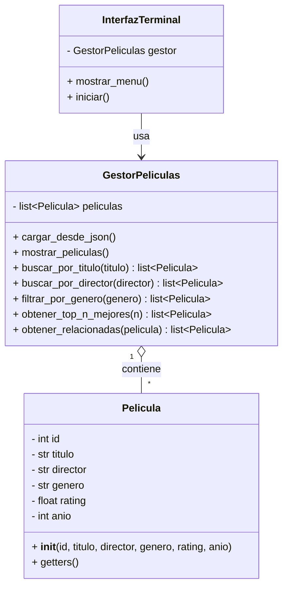

# Propuesta del proyecto

## Nombre del proyecto
Kino

## Dominio elegido
El dominio elegido para el proyecto fue el de las películas. Consideramos que es muy adecuado para la aplicación de las estructuras de datos que se pretende utilizar. Además, la temática nos resulta interesante a todos los integrantes del grupo.

## Problema que resuelve
Kino es una herramienta que le permite al usuario encontrar la película perfecta para ver de manera sencilla y efectiva de acuerdo a sus intereses personales, sin tener que hacer el trabajo manual de buscar películas o leer reseñas.

## Usuario objetivo
DIrigido al estudiante universitario o profesional joven aficionado al cine, que suele disponer de poco tiempo libre. Busca una opción rápida para elegir una película alineada a sus gustos sin perder tiempo.

## 5 funcionalidades iniciales
1. Buscar película por título
2. Listar todas las películas
3. Filtrar por categoría/género
4. Ver películas relacionadas
5. Ver top N mejores películas

## Ejemplo de interacción
Al iniciar el programa, el usuario vería una interfaz de este estilo, y podría elegir la opción que desee introduciendo los números por teclado.

```
==================================================
                Bienvenido a Kino!
==================================================
  1. Buscar película por título
  2. Mostrar todas las películas
  3. Filtrar películas por género
  0. Salir
--------------------------------------------------
```

## Diagrama inicial de clases



<br>

> **Descripción de las clases:**
> * **`Pelicula`**: Representa la unidad de información base de cada película, almacenando la información básica de cada una (título, director, género, rating y año)
> * **`GestorPeliculas`**: Encargada de cargar y gestionar la colección de películas, y de ejecutar la lógica de búsqueda, filtrado y recomendación (Top N y películas relacionadas)
> * **`InterfazTerminal`**: Muestra la interfaz gráfica de consola y procesa la interacción del usuario llamando a las funciones correspondientes del gestor.