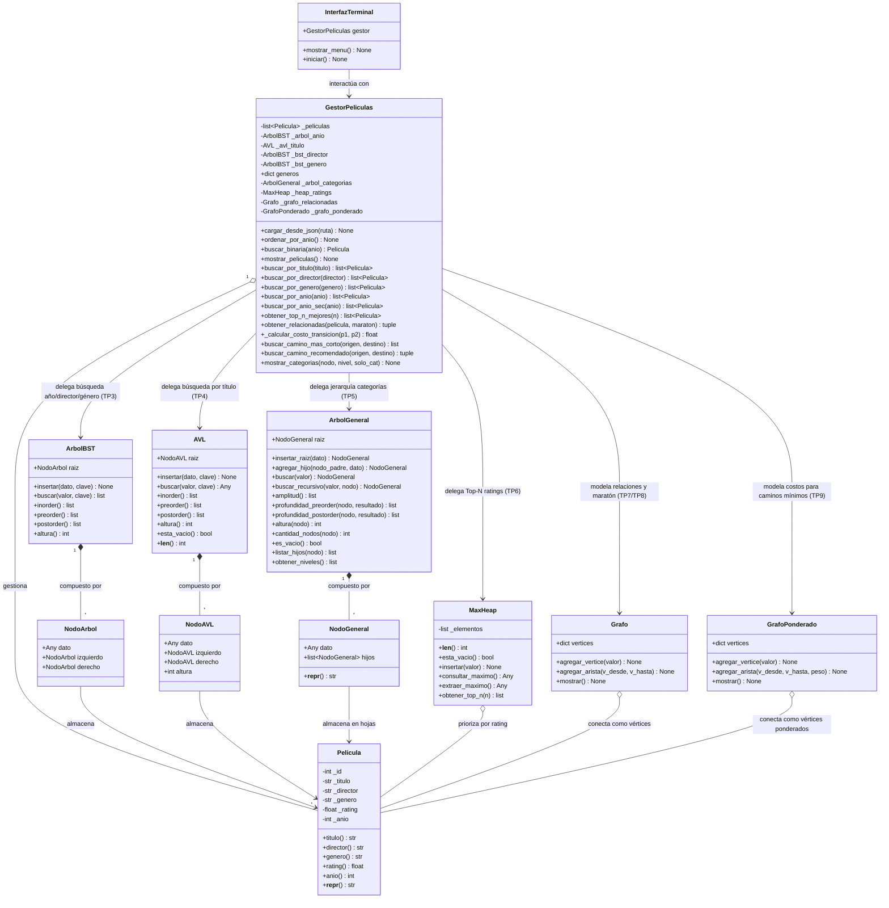

# Diagrama de clases — Kino

```mermaid
classDiagram
    class Pelicula {
        -int _id
        -str _titulo
        -str _director
        -str _genero
        -float _rating
        -int _anio
        +titulo() str
        +director() str
        +genero() str
        +rating() float
        +anio() int
        +__repr__() str
    }

    class InterfazTerminal {
        +GestorPeliculas gestor
        +mostrar_menu() None
        +iniciar() None
    }

    class GestorPeliculas {
        -list~Pelicula~ _peliculas
        -ArbolBST _arbol_anio
        -AVL _avl_titulo
        -ArbolBST _bst_director
        -ArbolBST _bst_genero
        +dict generos
        -ArbolGeneral _arbol_categorias
        -MaxHeap _heap_ratings
        -Grafo _grafo_relacionadas
        -GrafoPonderado _grafo_ponderado
        +cargar_desde_json(ruta) None
        +ordenar_por_anio() None
        +buscar_binaria(anio) Pelicula
        +mostrar_peliculas() None
        +buscar_por_titulo(titulo) list~Pelicula~
        +buscar_por_director(director) list~Pelicula~
        +buscar_por_genero(genero) list~Pelicula~
        +buscar_por_anio(anio) list~Pelicula~
        +buscar_por_anio_sec(anio) list~Pelicula~
        +obtener_top_n_mejores(n) list~Pelicula~
        +obtener_relacionadas(pelicula, maraton) tuple
        +_calcular_costo_transicion(p1, p2) float
        +buscar_camino_mas_corto(origen, destino) list
        +buscar_camino_recomendado(origen, destino) tuple
        +mostrar_categorias(nodo, nivel, solo_cat) None
    }

    class NodoArbol {
        +Any dato
        +NodoArbol izquierdo
        +NodoArbol derecho
    }

    class ArbolBST {
        +NodoArbol raiz
        +insertar(dato, clave) None
        +buscar(valor, clave) list
        +inorder() list
        +preorder() list
        +postorder() list
        +altura() int
    }

    class NodoAVL {
        +Any dato
        +NodoAVL izquierdo
        +NodoAVL derecho
        +int altura
    }

    class AVL {
        +NodoAVL raiz
        +insertar(dato, clave) None
        +buscar(valor, clave) Any
        +inorder() list
        +preorder() list
        +postorder() list
        +altura() int
        +esta_vacio() bool
        +__len__() int
    }

    class NodoGeneral {
        +Any dato
        +list~NodoGeneral~ hijos
        +__repr__() str
    }

    class ArbolGeneral {
        +NodoGeneral raiz
        +insertar_raiz(dato) NodoGeneral
        +agregar_hijo(nodo_padre, dato) NodoGeneral
        +buscar(valor) NodoGeneral
        +buscar_recursivo(valor, nodo) NodoGeneral
        +amplitud() list
        +profundidad_preorder(nodo, resultado) list
        +profundidad_postorder(nodo, resultado) list
        +altura(nodo) int
        +cantidad_nodos(nodo) int
        +es_vacio() bool
        +listar_hijos(nodo) list
        +obtener_niveles() list
    }

    class MaxHeap {
        -list _elementos
        +__len__() int
        +esta_vacio() bool
        +insertar(valor) None
        +consultar_maximo() Any
        +extraer_maximo() Any
        +obtener_top_n(n) list
    }

    class Grafo {
        +dict vertices
        +agregar_vertice(valor) None
        +agregar_arista(v_desde, v_hasta) None
        +mostrar() None
    }

    class GrafoPonderado {
        +dict vertices
        +agregar_vertice(valor) None
        +agregar_arista(v_desde, v_hasta, peso) None
        +mostrar() None
    }

    InterfazTerminal --> GestorPeliculas : interactúa con
    GestorPeliculas "1" o-- "*" Pelicula : gestiona
    GestorPeliculas --> ArbolBST : delega búsqueda año/director/género (TP3)
    GestorPeliculas --> AVL : delega búsqueda por título (TP4)
    GestorPeliculas --> ArbolGeneral : delega jerarquía categorías (TP5)
    GestorPeliculas --> MaxHeap : delega Top-N ratings (TP6)
    GestorPeliculas --> Grafo : modela relaciones y maratón (TP7/TP8)
    GestorPeliculas --> GrafoPonderado : modela costos para caminos mínimos (TP9)

    ArbolBST "1" *-- "*" NodoArbol : compuesto por
    AVL "1" *-- "*" NodoAVL : compuesto por
    ArbolGeneral "1" *-- "*" NodoGeneral : compuesto por

    NodoArbol --> Pelicula : almacena
    NodoAVL --> Pelicula : almacena
    NodoGeneral --> Pelicula : almacena en hojas
    MaxHeap o-- Pelicula : prioriza por rating
    Grafo o-- Pelicula : conecta como vértices
    GrafoPonderado o-- Pelicula : conecta como vértices ponderados
```