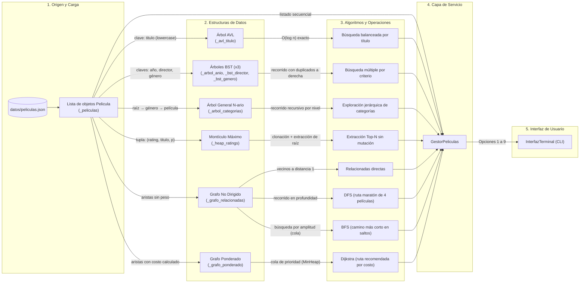

# Conexión entre estructuras — Kino

```mermaid
graph LR
    subgraph Datos["1. Origen y Carga"]
        JSON[(datos/peliculas.json)] --> LISTA["Lista de objetos Pelicula<br>(_peliculas)"]
    end

    subgraph Estructuras["2. Estructuras de Datos"]
        LISTA -->|"clave: titulo (lowercase)"| AVL["Árbol AVL<br>(_avl_titulo)"]
        LISTA -->|"claves: año, director, género"| BST["Árboles BST (x3)<br>(_arbol_anio, _bst_director, _bst_genero)"]
        LISTA -->|"raíz → género → película"| NARIO["Árbol General N-ario<br>(_arbol_categorias)"]
        LISTA -->|"tupla: (rating, titulo, p)"| HEAP["Montículo Máximo<br>(_heap_ratings)"]
        LISTA -->|"aristas sin peso"| GRAFO["Grafo No Dirigido<br>(_grafo_relacionadas)"]
        LISTA -->|"aristas con costo calculado"| GRAFO_POND["Grafo Ponderado<br>(_grafo_ponderado)"]
    end

    subgraph Algoritmos["3. Algoritmos y Operaciones"]
        AVL -->|"O(log n) exacto"| BUSQ_AVL["Búsqueda balanceada por título"]
        BST -->|"recorrido con duplicados a derecha"| BUSQ_BST["Búsqueda múltiple por criterio"]
        NARIO -->|"recorrido recursivo por nivel"| REC_NARIO["Exploración jerárquica de categorías"]
        HEAP -->|"clonación + extracción de raíz"| TOP_N["Extracción Top-N sin mutación"]
        GRAFO -->|"vecinos a distancia 1"| VECINOS["Relacionadas directas"]
        GRAFO -->|"recorrido en profundidad"| DFS["DFS (ruta maratón de 4 películas)"]
        GRAFO -->|"búsqueda por amplitud (cola)"| BFS["BFS (camino más corto en saltos)"]
        GRAFO_POND -->|"cola de prioridad (MinHeap)"| DIJKSTRA["Dijkstra (ruta recomendada por costo)"]
    end

    subgraph Servicio["4. Capa de Servicio"]
        LISTA -->|"listado secuencial"| GESTOR["GestorPeliculas"]
        BUSQ_AVL --> GESTOR
        BUSQ_BST --> GESTOR
        REC_NARIO --> GESTOR
        TOP_N --> GESTOR
        VECINOS --> GESTOR
        DFS --> GESTOR
        BFS --> GESTOR
        DIJKSTRA --> GESTOR
    end

    subgraph Presentacion["5. Interfaz de Usuario"]
        GESTOR -->|"Opciones 1 a 9"| UI["InterfazTerminal (CLI)"]
    end
```